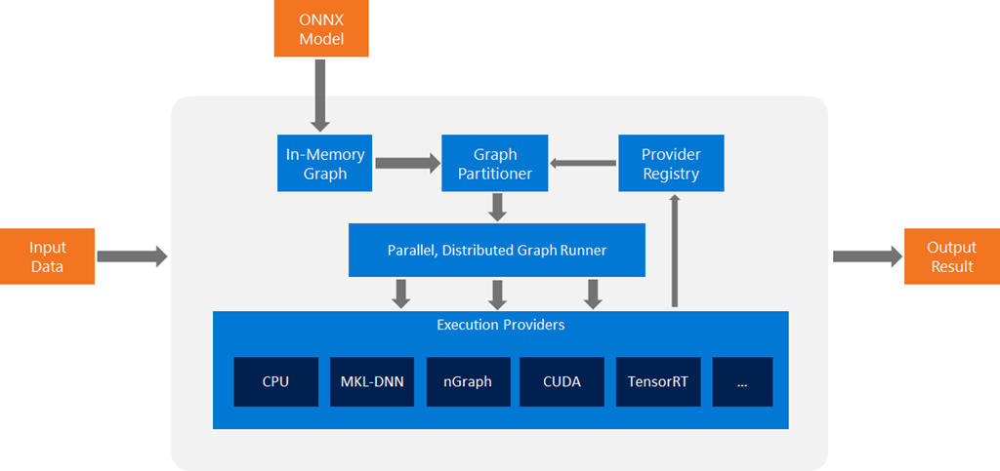

# Hello [ORT(OnnxRumTime)](https://onnxruntime.ai/)

An **ONNX(Open Neural Network Exchange) Runtime** Demo

## About ORT

- ORT DOC: <https://onnxruntime.ai/docs>
- ORT Github: <https://github.com/microsoft/onnxruntime>
- ORT Maven Repo: <https://mvnrepository.com/artifact/com.microsoft.onnxruntime>
- ORT Architecture: 
- ORT Workflow: 
  - [TensorRT](https://developer.nvidia.com/tensorrt)
  - [PyTorch](https://pytorch.org/)
  - [TensorFlow](https://www.tensorflow.org/)
  - [onnx runtime](https://onnxruntime.ai/)
  - [OpenVino](https://openvino.ai/)

## About dependencies

### 1 [CUDA](doc/CUDA.md)

#### Microarchitecture

1. [Tesla](https://en.wikipedia.org/wiki/Tesla_(microarchitecture))  [特斯拉](https://zh.wikipedia.org/wiki/%E5%B0%BC%E5%8F%A4%E6%8B%89%C2%B7%E7%89%B9%E6%96%AF%E6%8B%89)
2. [Fermi](https://en.wikipedia.org/wiki/Fermi_(microarchitecture))  [费米](https://zh.wikipedia.org/wiki/%E6%81%A9%E9%87%8C%E7%A7%91%C2%B7%E8%B4%B9%E7%B1%B3)
3. [Kepler](https://en.wikipedia.org/wiki/Kepler_(microarchitecture)) [开普勒](https://zh.wikipedia.org/wiki/%E7%BA%A6%E7%BF%B0%E5%86%85%E6%96%AF%C2%B7%E5%BC%80%E6%99%AE%E5%8B%92)
4. [Maxwell](https://en.wikipedia.org/wiki/Maxwell_(microarchitecture)) [麦克斯韦](https://zh.wikipedia.org/wiki/%E8%A9%B9%E5%A7%86%E6%96%AF%C2%B7%E5%85%8B%E6%8B%89%E5%85%8B%C2%B7%E9%BA%A6%E5%85%8B%E6%96%AF%E9%9F%A6)
5. [Pascal](https://en.wikipedia.org/wiki/Pascal_(microarchitecture))  [帕斯卡](https://zh.wikipedia.org/wiki/%E5%B8%83%E8%8E%B1%E5%85%B9%C2%B7%E5%B8%95%E6%96%AF%E5%8D%A1)
6. [Volta](https://en.wikipedia.org/wiki/Volta_(microarchitecture))  [伏打](https://zh.wikipedia.org/wiki/%E4%BA%9E%E6%AD%B7%E5%B1%B1%E5%BE%B7%E7%BE%85%C2%B7%E4%BC%8F%E6%89%93)
7. [Turing](https://en.wikipedia.org/wiki/Turing_(microarchitecture))  [图灵](https://zh.wikipedia.org/wiki/%E8%89%BE%E4%BC%A6%C2%B7%E5%9B%BE%E7%81%B5)
8. [Ampere](https://en.wikipedia.org/wiki/Ampere_(microarchitecture))  [安培](https://zh.wikipedia.org/wiki/%E5%AE%89%E5%BE%B7%E7%83%88-%E9%A6%AC%E9%87%8C%C2%B7%E5%AE%89%E5%9F%B9)
9. [Ada Lovelace](https://en.wikipedia.org/wiki/Ada_Lovelace_(microarchitecture))  [阿达·洛芙莱斯](https://zh.wikipedia.org/wiki/%E5%AE%89%E5%BE%B7%E7%83%88-%E9%A6%AC%E9%87%8C%C2%B7%E5%AE%89%E5%9F%B9)
10. [Hopper](https://en.wikipedia.org/wiki/Hopper_(microarchitecture)) [格蕾丝·赫柏](https://zh.wikipedia.org/wiki/%E8%91%9B%E9%BA%97%E7%B5%B2%C2%B7%E9%9C%8D%E6%99%AE)
11. [Blackwell](https://en.wikipedia.org/wiki/Blackwell_(microarchitecture))  [戴维·布莱克维尔](https://zh.wikipedia.org/wiki/%E6%88%B4%E7%BB%B4%C2%B7%E5%B8%83%E8%8E%B1%E5%85%8B%E9%9F%A6%E5%B0%94)

#### Requirements

- <https://onnxruntime.ai/docs/execution-providers/CUDA-ExecutionProvider.html#requirements>
- <https://docs.nvidia.com/deeplearning/cudnn/latest/installation/overview.html>

| |ONNX Runtime | CUDA(Compute Unified Device Architecture) | cuDNN(CUDA Deep Neural Network library)|
|:-------------|:-------------------------------|:---------------------------------|:-------------------------------------------------------|
| url| https://github.com/microsoft/onnxruntime/tags|https://developer.nvidia.com/cuda-toolkit-archive | <https://developer.nvidia.com/rdp/cudnn-archive> |
|version|1.18|CUDA Toolkit 11.8.0 (October 2022)|cuDNN v8.9.2 (June 1st, 2023), for CUDA 11.x|
|version|1.18|CUDA Toolkit 12.5.0 (May 2024)|cuDNN v8.9.7 (December 5th, 2023), for CUDA 12.x|

```env
CUDA_PATH=D:\garden\cuda12.5
CUDNN_PATH=D:\garden\cudnn8.9.7.29_cuda12
PATH=%CUDA_PATH%\bin;%CUDA_PATH%\libnvvp;%CUDNN_PATH%\bin;...

cp "C:\Program Files\NVIDIA Corporation\Nsight Systems 2024.2.3\host-windows-x64\zlib.dll" D:\garden\cuda12.5\bin
```

```sh
env | grep CUDA
```

CUDA Driver API 版本

```sh
nvidia-smi
```

CUDA Runtime API 版本

```sh
nvcc -V
```

每隔5秒刷新一次GPU使用情况

```sh
watch -n 5 nvidia-smi
```


### 2 CoreML

<https://developer.apple.com/documentation/coreml>

Which devices have an ANE?

<https://github.com/hollance/neural-engine/blob/master/docs/supported-devices.md>

## MORE…

### Issues solved

#### UnsatisfiedLinkError on MacOS

```sh
UnsatisfiedLink no onnxruntime in java.library.path
```

reload the dependency jar file and check it:


```sh
no cudart in java.library.path

-Djava.library.path=D:\\coding\\cuda\\11.8\\lib\\x64
```

### A Deep Dive into ONNX & ONNX Runtime

- <https://medium.com/becoming-human/a-deep-dive-into-onnx-onnx-runtime-part-1-874517c66ffc>
- <https://medium.com/becoming-human/a-deep-dive-into-onnx-onnx-runtime-part-2-785b523e0cca>
